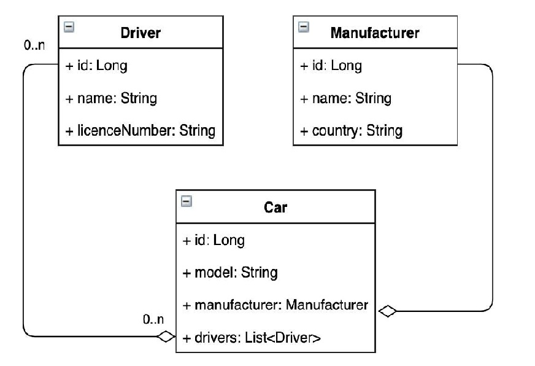

# TAXI SERVICE
**Features** 📄
- registration page
- login/logout pages
- create, update and remove cars/manufacturers/drivers pages
- display all cars, drivers and manufacturers pages

**Test Project**

https://taxi-service-v-oliinyk.herokuapp.com/login

**Project structure** 📄

The project based on N-Tier architecture:
- DAO layer - work with database
- Service layer - business logic
- Controllers - accept requests from the clients and send responses

**Technologies** 📡
- Java
- JDBC
- MySQL
- Tomcat
- Maven
- HTML+CSS
- Dependency injection
- JSP

**Instruction to run the project** 📄
1. Fork this repository
2. Clone your repository to IDE
3. Edit ConnectionUtil - [util/ConnectionUtil.java](https://github.com/vov4ik89/taxi-service/blob/main/src/main/java/taxi/util/ConnectionUtil.java#L9)
```diff 
   private static final String URL = "URL";
   private static final String USERNAME = "USER NAME";
   private static final String PASSWORD = "PASSWORD";
   private static final String JDBC_DRIVER = "JDBC DRIVER";
```
4. Create necessary tables in your database using the file init_db.sql
5. Install Tomcat
6. Configure Tomcat Server
7. Run the project


   
